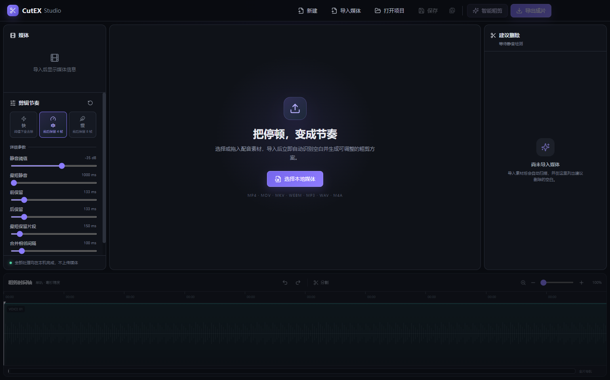

# CutEX Studio MVP

[](https://github.com/Old-Paper/CutEX-Studio/actions/workflows/ci.yml)
[](https://github.com/Old-Paper/CutEX-Studio/releases/latest)
[](LICENSE)

面向 Windows 的本地配音自动粗剪桌面应用。导入视频或音频后，CutEX 会立即使用 FFmpeg 检测配音停顿并生成建议删除区间；从头审听时按 `X` 即可反选播放头所在的完整片段，最后用精确重编码方式导出成片。

所有媒体处理都在本机完成，不上传文件。



## 下载 Windows 版

前往 [GitHub Releases](https://github.com/Old-Paper/CutEX-Studio/releases/latest) 下载最新的 `CutEX-Studio-*-Windows.exe`。当前版本需要系统已安装 FFmpeg/FFprobe，安装方式见下文。

## 快速开始

使用流程：选择或拖入素材后等待自动粗剪完成，按 `Space` 从头播放；听到需要修正的片段时按 `X`，即可在“删除 / 保留”之间切换。播放中标记删除会立即跳过当前片段。

时间轴操作：普通滚轮横向浏览，`Alt + 滚轮` 以鼠标所在位置为中心缩放；底部全片导航条可点击跳转，放大后拖动紫色可视窗口可快速平移。

导出加速：MP4、MOV、MKV 可在导出窗口选择 CPU、NVIDIA NVENC、Intel Quick Sync 或 AMD AMF。软件会实际测试当前设备，只启用可用 GPU；GPU 失败时自动回退 CPU。WebM 和纯音频会自动使用对应的软件编码器。

导出方式：默认“快速导出”使用分段清单串行读取保留区间，适合数百个切点；“高精度兼容”保留原逐段毫秒滤镜流程。快速模式不兼容当前编码时会自动回退高精度模式。

环境要求：Node.js 20+、pnpm 9+、FFmpeg/FFprobe 6+。

```bash
corepack enable
pnpm install
pnpm dev
```

其他命令：

```bash
pnpm typecheck   # TypeScript 严格类型检查
pnpm test        # Vitest 单元测试
pnpm coverage    # 核心算法覆盖率
pnpm lint        # ESLint
pnpm build       # 生产构建
pnpm package     # Windows 便携版
```

打包结果位于 `release/`。

## Windows 安装 FFmpeg

推荐使用 winget：

```powershell
winget install --id Gyan.FFmpeg -e
ffmpeg -version
ffprobe -version
```

也可以设置 `FFMPEG_PATH` 和 `FFPROBE_PATH` 为可执行文件绝对路径。当前 MVP 采用外部 FFmpeg，避免安装依赖从 GitHub 下载大体积二进制导致 `npm install` 不稳定。正式分发版可在 electron-builder 的 `extraResources` 中内置已核验的 FFmpeg Windows 二进制，并通过这两个环境变量或 `process.resourcesPath` 解析。

## 架构

```text
src/
  main/
    ffmpeg/       # 二进制路径、任务管理、silencedetect
    ffprobe/      # 媒体元数据读取
    ipc/          # 白名单 IPC
    project/      # 项目保存、打开、最近记录、媒体重定位
    export/       # 精确裁切、拼接与进度
    logger/       # 完整导出日志
  preload/        # contextBridge 安全 API
  renderer/
    components/   # 工作台面板、预览、反馈
    timeline/     # 单轨时间轴与边缘拖动
    hooks/        # 集中式快捷键
    stores/       # Zustand 编辑器状态与历史
    types/
    utils/
  shared/
    types/        # IPC 与项目共享类型
    constants/    # 默认参数和格式
    ranges.ts     # 纯区间算法
    history.ts    # 纯撤销/重做
    exportArgs.ts # 纯 FFmpeg 参数生成
tests/
```

选择 Zustand 是因为 MVP 状态域较多、动作关系明确，但不需要 Redux 的样板代码。媒体、检测、时间轴、选择、播放、任务、历史和项目数据在同一类型化 store 中分域保存；区间计算和 FFmpeg 参数生成仍保持独立纯函数。

### 核心数据

- `TimeRange`：`id`、`startMs`、`endMs`，全部为整数毫秒。
- `DeletionRange`：在 `TimeRange` 上增加启用状态与来源。
- `MediaInfo`：路径、时长、尺寸、编码、帧率、视频/音频标记和全部音轨。
- `DetectionParameters`：阈值、最短静音、前后保留、最短保留片段与合并距离。
- `ProjectData`：版本、媒体、检测结果、手工区间、缩放和最后播放位置。

### IPC 白名单

- `media:select`：选择文件并运行 FFprobe。
- `analysis:start`：运行 `silencedetect`。
- `task:cancel`：取消分析或导出子进程。
- `project:save` / `project:open` / `project:recent`：项目文件操作。
- `export:start`：选择输出路径并运行精确导出。
- `file:reveal`：在资源管理器中显示成功输出。
- `task:progress`：主进程向渲染层发送任务进度。

渲染进程开启 `contextIsolation` 与沙箱，关闭 `nodeIntegration`，只能通过 preload 的类型化 API 访问上述能力。

## FFmpeg 调用方案

- FFprobe：`-print_format json -show_format -show_streams`，解析格式、视频流和所有音频流。
- 静音检测：选择绝对流索引后使用不低于 `silencedetect=noise=-35dB:d=1.000` 的持续时间，从 stderr 解析开始/结束时间；1 秒及以下的静音和最终自动删除片段会被严格忽略。
- 精确导出：每个保留区间分别使用 `trim + setpts` 和 `atrim + asetpts`，最后 `concat`；支持 MP4、MOV、MKV、WebM、MP3、WAV、M4A，并为容器选择 H.264/AAC、VP9/Opus、MP3 或 PCM 编码。
- 大量切点的复杂滤镜会写入临时脚本再交给 FFmpeg，避免超过 Windows 进程启动参数长度限制；任务结束后自动清理。
- H.264 使用兼容性稳定的 x264 `veryfast` 软件预设；WebM 启用 VP9 行级多线程，避免默认硬件编码带来的显卡和驱动兼容问题。
- 所有命令均使用 `spawn(executable, args[])`，不拼接 shell 字符串，因此兼容空格、Unicode 和中文路径。

## 已完成功能

- Electron + React + TypeScript + Vite 工程、严格模式、ESLint、Vitest、electron-builder。
- MP4/MOV/MKV/WebM/MP3/WAV/M4A 文件选择或整窗拖放导入，以及 FFprobe 元数据、多音轨选择。
- 导入后自动使用当前节奏预设完成静音检测与粗剪，不需要额外点击分析按钮。
- 静音检测参数、原始静音、建议删除和最终保留区间生成及全部边界修正；自动标记只保留超过 1 秒的静音删除片段。
- 深色三栏编辑工作台、视频/音频预览、播放控制、时间显示和跳转。
- FFmpeg PCM 真波形：2,400 个时间桶的峰值与 RMS，Canvas 高性能绘制并与时间轴精确对齐。
- 快/中/慢三档节奏预设；中、慢档按素材真实帧率换算前后 4 帧和 8 帧。
- 单轨时间轴、缩放/滚动、播放头、单选/Ctrl 多选/Shift 连选、边缘拖动、吸附与精确提示。
- 全片导航条、滚轮横移与 `Alt + 滚轮` 定点缩放；删除标记按真实时间比例绘制，避免低缩放下假重叠。
- 集中式快捷键：`Space` 播放、`X` 反选播放头所在片段；含输入控件焦点保护、100 步撤销/重做和连续拖动单步历史。
- 新建、保存、另存为、打开、最近项目持久化、媒体丢失后重新定位。
- MP4/MOV/MKV/WebM/MP3/WAV/M4A 格式选择、精确导出、进度、取消、错误摘要、完整日志和输出定位。
- CPU/GPU 编码选择、NVIDIA/Intel/AMD 真实可用性检测，以及 GPU 失败自动回退 CPU。
- 快速分段导出与高精度兼容模式；大量切点不再创建成百上千条并行滤镜。
- 空状态、禁用状态、加载/进度、成功和错误反馈。

## 当前限制

- 最近项目已由主进程维护并通过 IPC 提供，但 MVP 界面暂未加入最近项目下拉列表。
- 预览使用 Chromium 支持的本地编码；部分 MKV、MOV 或专业编码可正常分析/导出但不能直接预览。
- 粗剪预览会自动跳过删除区间，但跳点附近仍可能受源视频关键帧和解码器性能影响。
- 波形在导入和切换音轨时重新计算，暂未写入磁盘缓存；超长素材首次生成需要等待。
- 尚未提供时间轴区间整体移动，只支持边缘调整；不做多轨、字幕、转场和代理文件。
- FFmpeg 需要安装到 PATH 或通过环境变量指定，便携包暂未内置二进制。

## 主要风险与后续建议

1. 为正式分发包内置固定版本 FFmpeg，并验证 LGPL/GPL 许可与编码器组合。
2. 增加波形磁盘缓存和代理媒体，改善超长或专业编码素材的编辑体验。
3. 加入最近项目下拉入口、自动保存、崩溃恢复和项目迁移器。
4. 使用真实长视频、VFR、无音频、纯音频和多语言多音轨素材做端到端回归。
5. 增加安装版签名、自动更新、硬件编码选项与导出磁盘空间预检。

## 本次验证

- TypeScript：通过（renderer/shared 与 main/preload 两套严格配置）。
- Vitest：55 个常规测试全部通过；另有 5 个真实 FFmpeg 集成测试通过。
- 覆盖率：`src/shared` 语句/函数/行覆盖率 100%，区间算法分支覆盖率 91.8%。
- 生产构建：main、preload、renderer 全部成功。
- 桌面启动：生产资源实际启动 10 秒，进程保持运行且 stderr 为空。
- 视觉检查：使用 Electron 页面截图验证了完整空状态工作台，而非仅检查构建产物。
- Windows 打包：`CutEX-Studio-0.7.0-Windows.exe` 成功生成；真实验证 NVIDIA GPU、快速分段、自动回退和 762 切点长素材压力测试。
